# Table Migration Architecture & Design Document

## Table of Contents
1. [Overview](#overview)
2. [Architecture](#architecture)
3. [Migration Flow](#migration-flow)
4. [Shadow Copy Strategy](#shadow-copy-strategy)
5. [Components](#components)
6. [Data Flow](#data-flow)
7. [Trigger Mechanism](#trigger-mechanism)
8. [Metadata Management](#metadata-management)
9. [Backup & Rollback](#backup--rollback)
10. [Error Handling](#error-handling)
11. [Performance Considerations](#performance-considerations)

---

## Overview

The Data Manager table migration system enables zero-downtime migration of tables between PostgreSQL schemas. It supports two migration strategies:

1. **Normal Migration**: When the target table doesn't exist, creates a new table and copies data
2. **Shadow Copy Migration**: When the target table already exists, creates a shadow table with ULID-generated name and uses database triggers to synchronize changes

### Key Features
- ✅ Zero-downtime migration
- ✅ Continuous data synchronization via triggers
- ✅ Metadata versioning and backup
- ✅ Automatic rollback capability
- ✅ Asynchronous job processing (JobRunr)
- ✅ Schema-aware operations

---

## Architecture

### High-Level Architecture

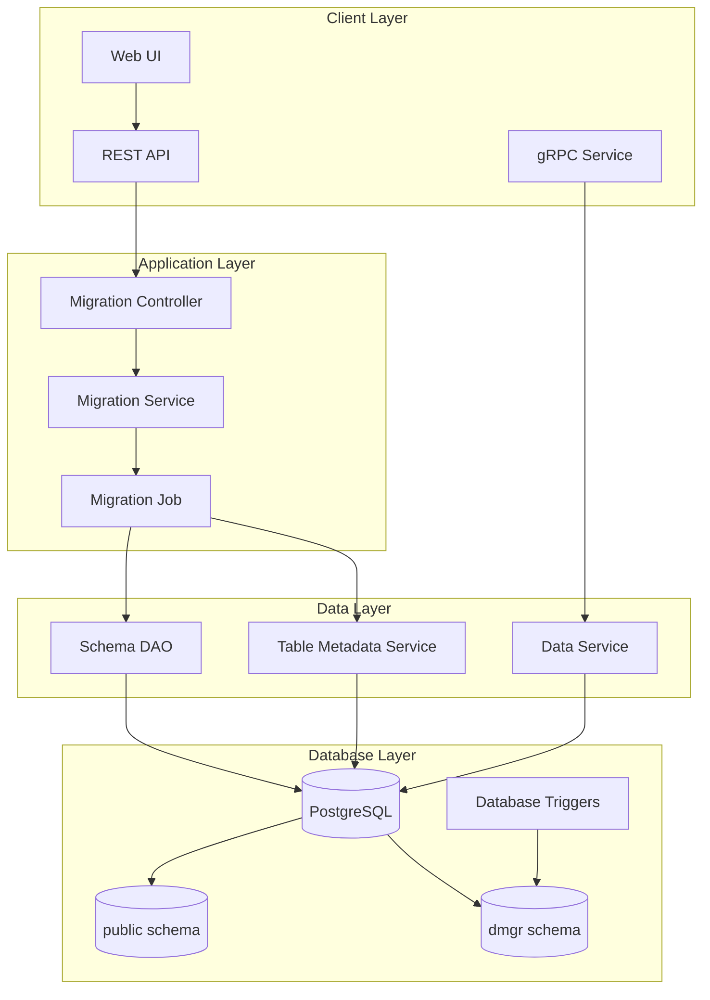

### Component Interaction

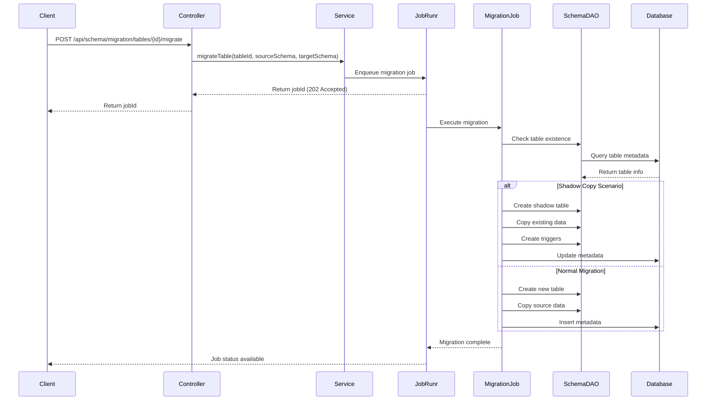

---

## Migration Flow

### Main Migration Flow

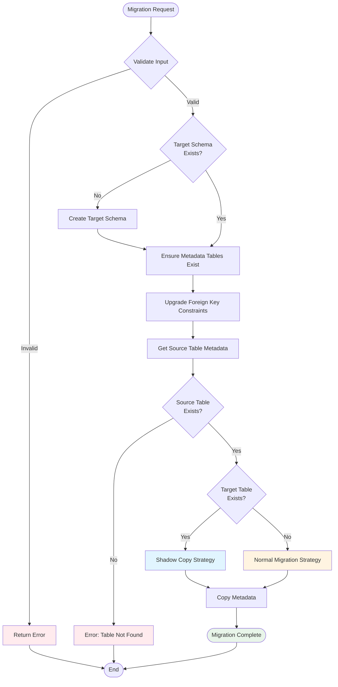

### Shadow Copy Flow (Detailed)

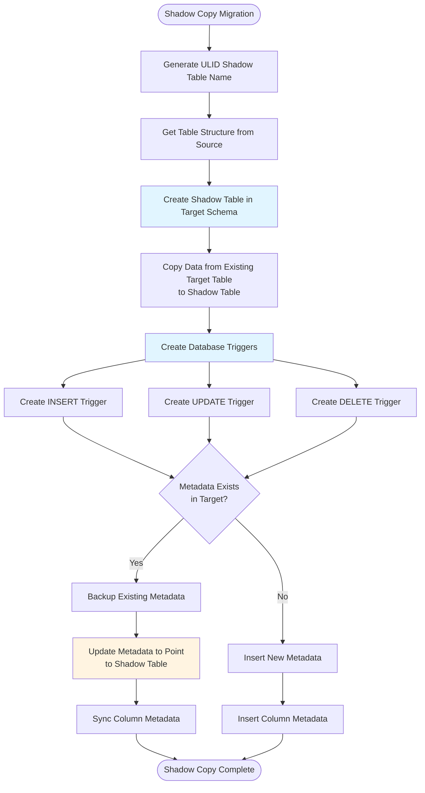

### Normal Migration Flow (Detailed)

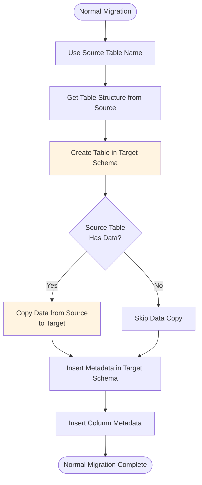

---

## Shadow Copy Strategy

### Why Shadow Copy?

When migrating from `public` to `dmgr` schema:
- The table may already exist in `dmgr` (e.g., from previous migration attempt)
- We need to preserve existing data in `dmgr`
- We need to merge data from `public` with `dmgr`
- Zero-downtime is critical

### Shadow Copy Architecture

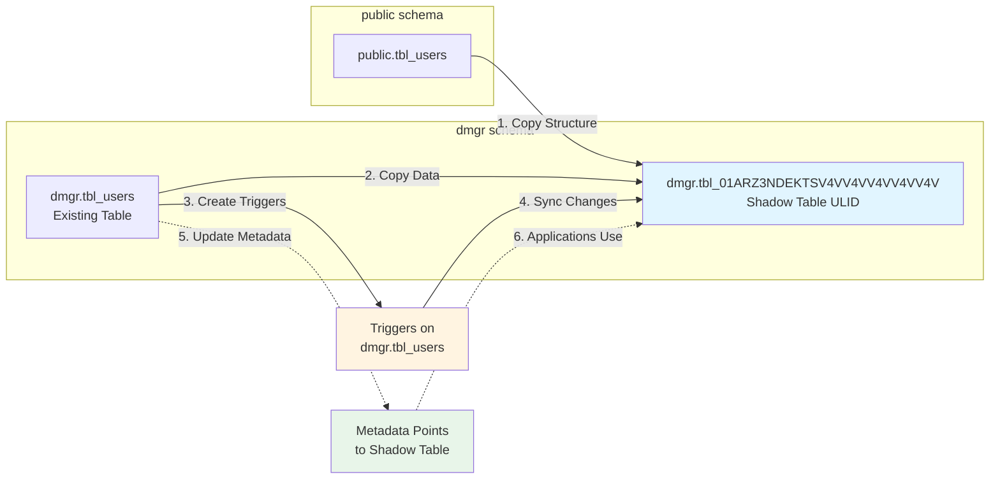

### Shadow Copy Steps

1. **Generate Shadow Table Name**: ULID-based unique name (e.g., `tbl_01ARZ3NDEKTSV4VV4VV4VV4VV4V`)
2. **Create Shadow Table**: Copy DDL structure from source table
3. **Copy Existing Data**: Bulk copy from existing target table to shadow table
4. **Create Triggers**: INSERT, UPDATE, DELETE triggers on existing table to sync to shadow
5. **Update Metadata**: Point metadata `tbl_link` to shadow table name
6. **Sync Column Metadata**: Ensure column definitions match

---

## Components

### TableMigrationService

**Responsibility**: Orchestrates the migration process

**Key Methods**:
- `migrateTable(Long tableId, String sourceSchema, String targetSchema)`: Main migration entry point
- `getAvailableSchemas()`: Returns list of schemas available for migration

**Dependencies**:
- `SchemaDao`: Database operations
- `DSLContext`: JOOQ query builder
- `MigrationProperties`: Configuration

### SchemaDao

**Responsibility**: Database schema and table operations

**Key Methods**:
- `tableExistsInSchema(String tableName, String schema)`: Check table existence
- `getTableStructure(String tableName, String schema)`: Get table DDL
- `bulkCopyTableData(...)`: Copy data between tables
- `createTrigger(...)`: Create database triggers
- `createMetadataTablesInSchema(String schema)`: Create metadata tables

### TableMigrationJob

**Responsibility**: Asynchronous job execution

**Features**:
- Runs migration in background via JobRunr
- Provides job status tracking
- Handles job failures and retries

---

## Data Flow

### Data Synchronization During Migration

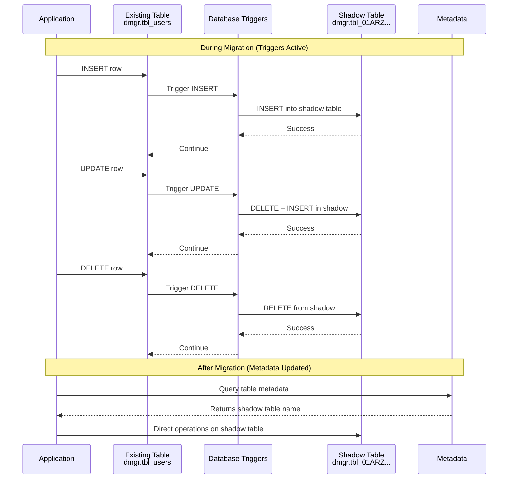

### Metadata Flow

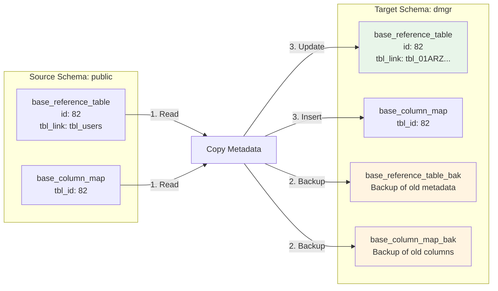

---

## Trigger Mechanism

### Trigger Function Generation

For each operation type (INSERT, UPDATE, DELETE), a PostgreSQL function is created:

#### INSERT Trigger

```sql
CREATE OR REPLACE FUNCTION migrate_insert_handler_<trigger_name>()
RETURNS TRIGGER AS $$
BEGIN
  INSERT INTO dmgr.tbl_shadow SELECT NEW.*;
  RETURN NEW;
END;
$$ LANGUAGE plpgsql;

CREATE TRIGGER trigger_migrate_82_<timestamp>_insert
AFTER INSERT ON dmgr.tbl_users
FOR EACH ROW EXECUTE FUNCTION migrate_insert_handler_<trigger_name>();
```

#### UPDATE Trigger

```sql
CREATE OR REPLACE FUNCTION migrate_update_handler_<trigger_name>()
RETURNS TRIGGER AS $$
BEGIN
  DELETE FROM dmgr.tbl_shadow WHERE id = NEW.id;
  INSERT INTO dmgr.tbl_shadow SELECT NEW.*;
  RETURN NEW;
END;
$$ LANGUAGE plpgsql;

CREATE TRIGGER trigger_migrate_82_<timestamp>_update
AFTER UPDATE ON dmgr.tbl_users
FOR EACH ROW EXECUTE FUNCTION migrate_update_handler_<trigger_name>();
```

#### DELETE Trigger

```sql
CREATE OR REPLACE FUNCTION migrate_delete_handler_<trigger_name>()
RETURNS TRIGGER AS $$
BEGIN
  DELETE FROM dmgr.tbl_shadow WHERE id = OLD.id;
  RETURN OLD;
END;
$$ LANGUAGE plpgsql;

CREATE TRIGGER trigger_migrate_82_<timestamp>_delete
AFTER DELETE ON dmgr.tbl_users
FOR EACH ROW EXECUTE FUNCTION migrate_delete_handler_<trigger_name>();
```

### Trigger Lifecycle

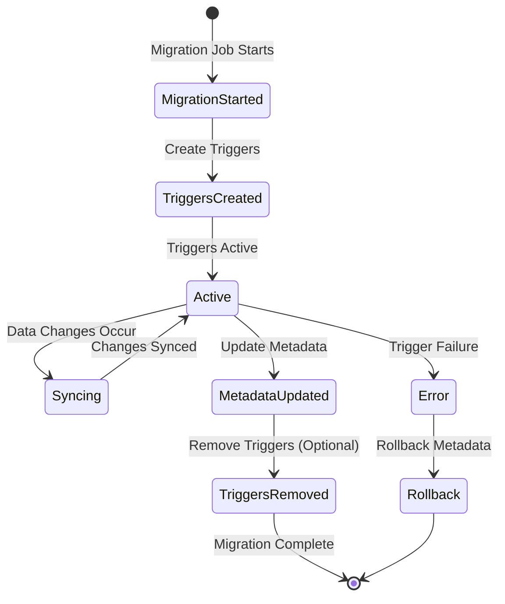

---

## Metadata Management

### Metadata Tables Structure

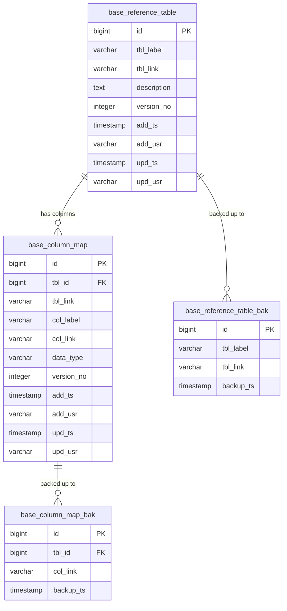

### Metadata Versioning

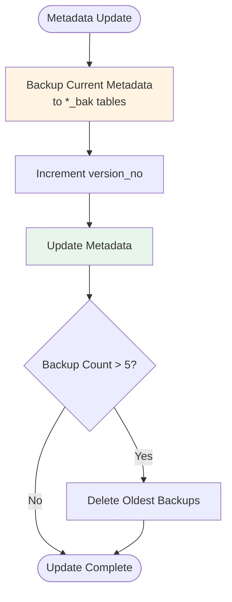

---

## Backup & Rollback

### Backup Strategy

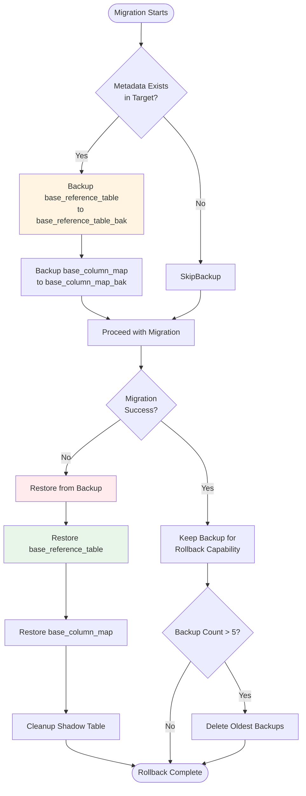

### Rollback Process

1. **Restore Metadata**: Copy from `*_bak` tables back to main tables
2. **Update `tbl_link`**: Point back to original table name
3. **Restore Columns**: Restore column metadata
4. **Cleanup**: Remove shadow table and triggers
5. **Version Rollback**: Decrement `version_no`

---

## Error Handling

### Error Scenarios & Handling

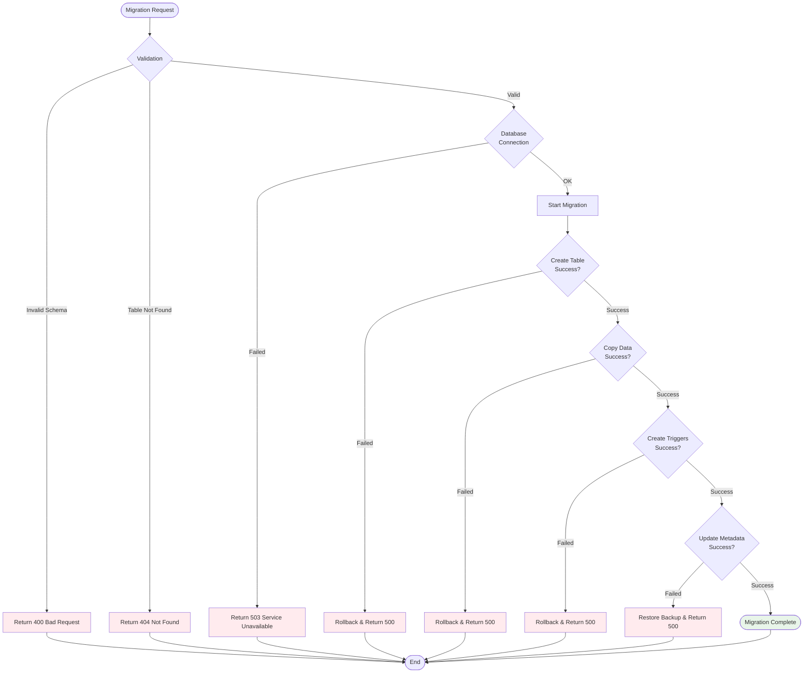

### Transaction Management

- **Migration is transactional**: All steps succeed or all rollback
- **Metadata updates are atomic**: Backup → Update → Commit
- **Trigger creation is idempotent**: Can be safely retried

---

## Performance Considerations

### Optimization Strategies

1. **Bulk Data Copy**: Uses PostgreSQL `INSERT INTO ... SELECT` for efficient bulk copy
2. **Asynchronous Processing**: Migration runs in background via JobRunr
3. **Trigger Efficiency**: Triggers use simple INSERT/DELETE operations
4. **Index Preservation**: Shadow table inherits indexes from source structure
5. **Connection Pooling**: Uses HikariCP for database connections

### Performance Impact

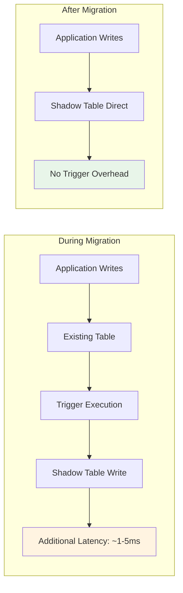

### Monitoring Points

- Migration job duration
- Trigger execution time
- Data copy throughput
- Metadata update latency
- Backup/restore performance

---

## API Reference

### Migration Endpoints

#### Trigger Migration
```
POST /api/schema/migration/tables/{tableId}/migrate?sourceSchema={source}&targetSchema={target}
```

**Response**: `202 Accepted`
```json
{
  "jobId": "019bde3d-b350-75ab-ac12-26e804982685",
  "status": "QUEUED",
  "message": "Migration job queued"
}
```

#### Get Migration Job Status
```
GET /api/schema/migration/jobs/{jobId}
```

**Response**: `200 OK`
```json
{
  "jobId": "019bde3d-b350-75ab-ac12-26e804982685",
  "status": "SUCCEEDED",
  "tableId": 82,
  "sourceSchema": "public",
  "targetSchema": "dmgr",
  "shadowTableName": "tbl_01ARZ3NDEKTSV4VV4VV4VV4VV4V",
  "startedAt": "2026-01-20T20:49:04Z",
  "completedAt": "2026-01-20T20:49:16Z",
  "duration": "12s"
}
```

---

## Conclusion

The migration architecture provides:

✅ **Zero-downtime migration** via shadow copy strategy  
✅ **Data consistency** through database triggers  
✅ **Rollback capability** via metadata backups  
✅ **Scalability** through asynchronous job processing  
✅ **Reliability** through comprehensive error handling  

This design enables seamless schema migrations while maintaining data integrity and application availability.
